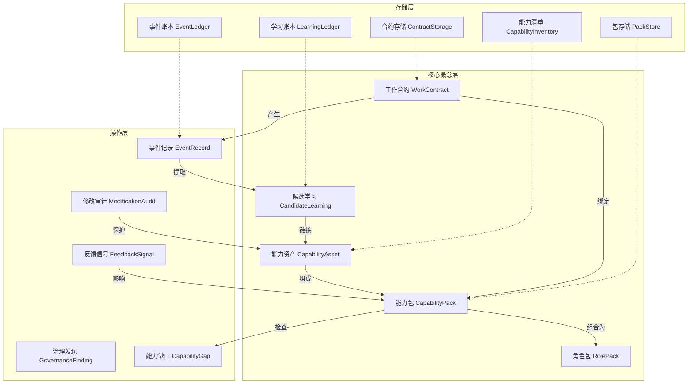
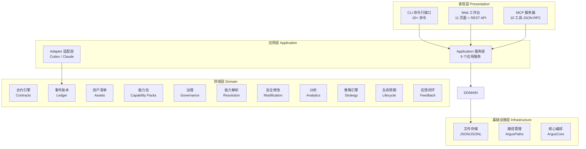
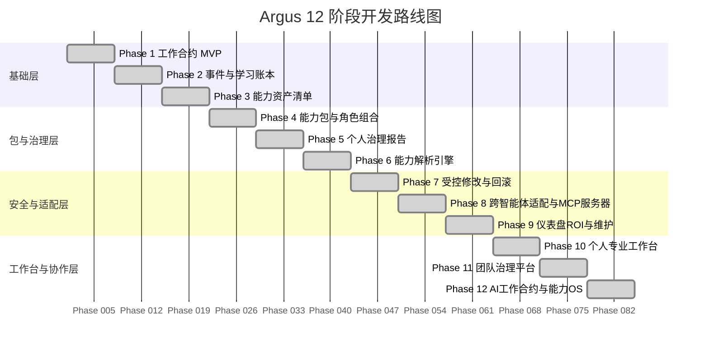
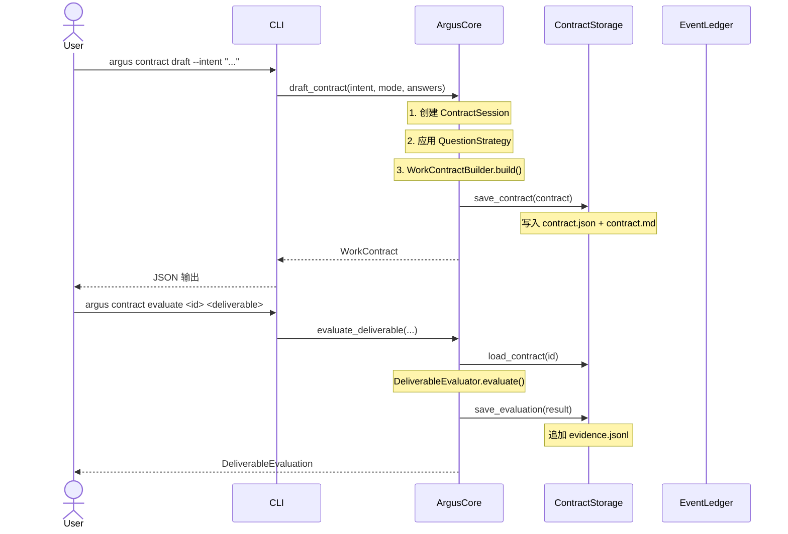
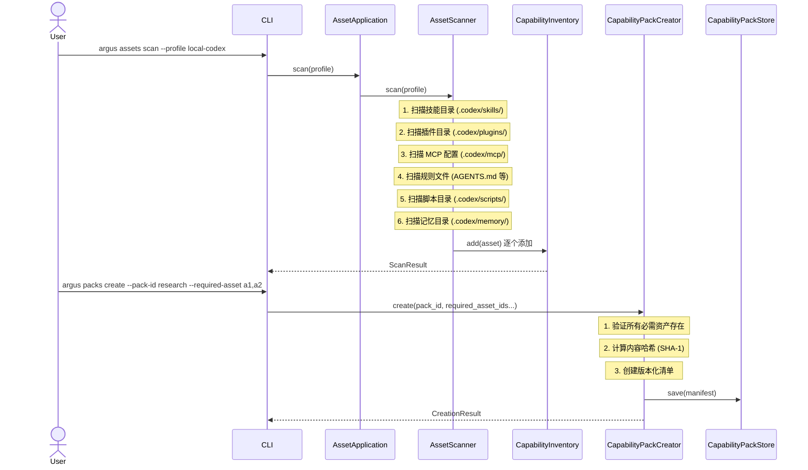
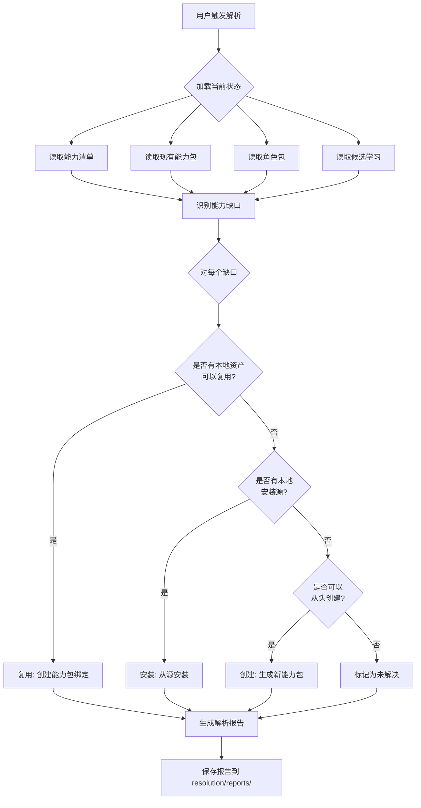
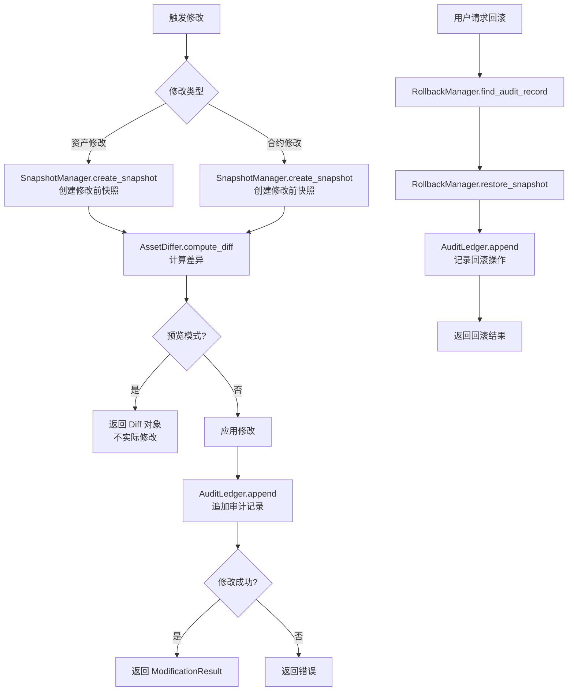
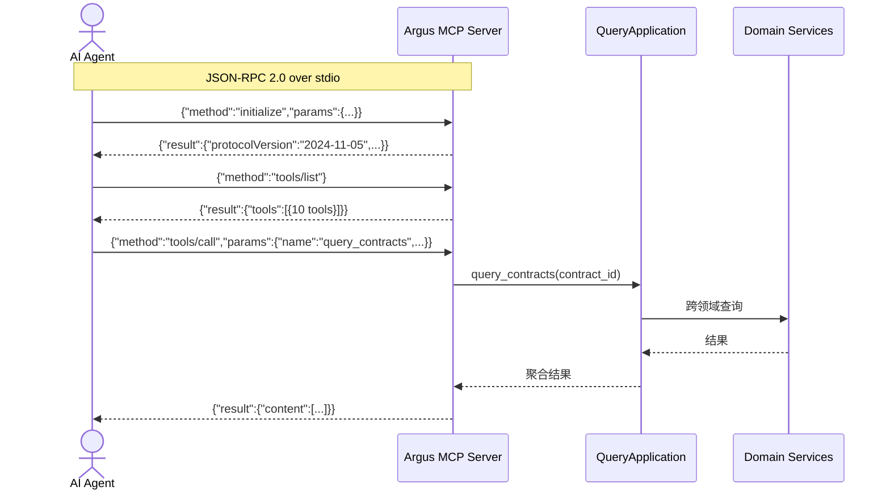
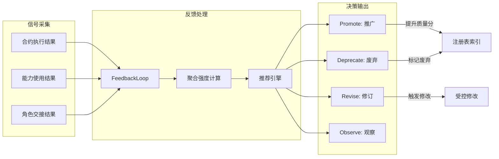
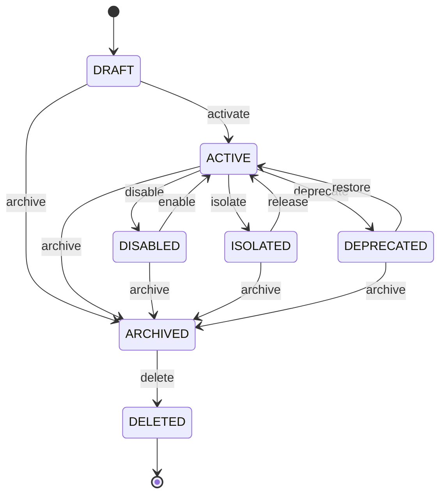

# Argus 技术架构文档

> **版本**: 1.0  
> **最后更新**: 2026-05-04  
> **目标读者**: 首次接触本项目的开发者  

---

## 目录

1. [项目概述](#1-项目概述)
2. [核心概念](#2-核心概念)
3. [系统架构总览](#3-系统架构总览)
4. [目录结构](#4-目录结构)
5. [12 阶段能力地图](#5-12-阶段能力地图)
6. [核心数据流](#6-核心数据流)
7. [包详解](#7-包详解)
8. [CLI 参考](#8-cli-参考)
9. [开发指南](#9-开发指南)

---

## 1. 项目概述

### 1.1 Argus 是什么？

Argus 是一个 **AI 智能体能力治理操作系统 (Capability Operating System)**。它为 AI 编码智能体（如 Claude Code、Codex）提供了一套完整的能力生命周期管理工具。

**核心功能**:
- 📋 **工作合约 (Work Contracts)**: 将模糊的自然语言意图转化为结构化的、可评估的工作合约
- 🔍 **能力资产扫描 (Capability Asset Scanning)**: 自动发现本地技能、插件、MCP 配置、规则、脚本等 AI 能力资产
- 📦 **能力包管理 (Capability Pack Management)**: 将能力资产组合为版本化的能力包，支持角色组合
- 🛡️ **治理报告 (Governance Reports)**: 生成个人治理报告，追踪低风险维护项和待处理操作
- 🔧 **安全修改 (Controlled Modification)**: 带快照、审计和回滚能力的资产修改系统
- 🔗 **跨智能体适配 (Cross-Agent Adapter)**: 运行时中立的智能体适配层，支持 Codex 和 Claude
- 🌐 **MCP 服务器**: 标准化的 JSON-RPC 2.0 服务器，向外部智能体暴露 Argus 能力
- 📊 **仪表盘与 ROI**: 本地 Web 工作台，策略自动化，安全扫描，版本锁定
- 👥 **团队治理**: 团队目录、策略控制、入职包生成
- 🔄 **生命周期管理**: 资产状态机，多注册表发现，闭环反馈

### 1.2 设计原则

1. **零外部依赖**: 整个项目仅使用 Python 标准库，最大程度降低供应链风险
2. **文件系统即数据库**: 所有数据以 JSON/JSONL 文件存储，无需数据库服务
3. **不可变事件溯源**: 事件账本采用 append-only JSONL，保证审计完整性
4. **运行时中立**: 核心模型不依赖任何特定 AI 智能体框架
5. **组合优于继承**: 使用 dataclass 和函数组合，避免深层继承

---

## 2. 核心概念

### 2.1 领域模型关系图



### 2.2 关键术语表

| 术语 | 英文 | 说明 |
|------|------|------|
| 工作合约 | Work Contract | 从用户意图生成的、包含目标、约束、验收标准的正式合约 |
| 事件账本 | Event Ledger | Append-only JSONL 文件，记录所有系统事件 |
| 候选学习 | Candidate Learning | 从事件中自动提取的学习条目 |
| 能力资产 | Capability Asset | 技能、插件、MCP 配置、规则、脚本等可复用 AI 能力单元 |
| 能力包 | Capability Pack | 一组相关能力资产的版本化集合 |
| 角色包 | Role Pack | 从多个能力包组合而成的角色定义 |
| 治理报告 | Governance Report | 定期生成的风险评估和合规报告 |
| 能力解析 | Capability Resolution | 自动匹配能力缺口与可用解决方案的过程 |
| 闭环反馈 | Closed-Loop Feedback | 根据使用结果自动调整能力推荐的系统 |

---

## 3. 系统架构总览

### 3.1 分层架构



### 3.2 数据存储结构

```
.argus/                          # 存储根目录 (可配置)
├── contracts/                   # 工作合约
│   └── {contract-id}/
│       ├── contract.json        # 合约定义
│       ├── contract.md          # 合约 Markdown
│       ├── evidence.jsonl       # 事件证据 (append-only)
│       ├── versions/            # 历史版本
│       │   └── v{1,2,...}.json
│       ├── deliverables/        # 交付物
│       │   └── {type}.md
│       └── evaluations/         # 评估结果
│           └── evaluation-{1,2,...}.json
│
├── ledger/                      # 事件账本
│   ├── events.jsonl             # 原始事件流 (append-only)
│   ├── candidate_learnings.jsonl # 候选学习条目
│   └── reports/                 # 学习报告
│
├── assets/                      # 能力资产
│   ├── inventory.json           # 资产清单
│   ├── link-report.json         # 学习-资产链接
│   └── reports/                 # 资产报告
│
├── capability-packs/            # 能力包
│   └── {pack-id}/
│       ├── pack.json
│       └── v{1,2,...}.json
│
├── role-packs/                  # 角色包
│   └── {role-id}/
│       ├── pack.json
│       └── v{1,2,...}.json
│
├── governance/reports/          # 治理报告
├── resolution/reports/          # 解析报告
├── modifications/               # 变更管理
│   ├── snapshots/               # 修改前快照
│   ├── audit.jsonl              # 审计日志 (append-only)
│   └── reports/                 # 修改报告
│
├── handoffs/                    # 角色交接记录
├── strategy.json                # 策略配置
├── locks/versions.json          # 版本锁
├── playbooks/                   # 个人剧本
├── teams/                       # 团队数据
│   ├── {team-id}.json
│   ├── catalogs/                # 团队目录
│   └── policies/                # 团队策略
├── lifecycle/ledger.jsonl       # 生命周期账本
├── registry/index.json          # 注册表索引
├── feedback/                    # 反馈信号
├── onboarding/                  # 入职包
├── reports/                     # 仪表盘报告
└── maintenance/                 # 维护报告
```

---

## 4. 目录结构

```
src/argus/
├── __init__.py                  # 包根
├── core.py                      # 核心编排器 ArgusCore
├── storage.py                   # 合约文件存储 ContractStorage
├── paths.py                     # 统一路径管理 ArgusPaths
│
├── contracts/                   # [Phase 1] 工作合约引擎
│   ├── models.py                # WorkContract, QuestionStrategy, CompletenessScore
│   ├── deliverables.py          # DeliverableContract 定义和 DeliverableEvaluator
│   ├── rendering.py             # DeliverableRenderer (PRD/Roadmap/ResearchPlan)
│   └── evidence.py              # 证据事件工厂函数
│
├── ledger/                      # [Phase 2] 事件和学习账本
│   ├── models.py                # EventRecord, CandidateLearning
│   ├── jsonl.py                 # JSONL 追加存储 (append-only)
│   ├── store.py                 # LedgerStore 基类
│   ├── learning.py              # 候选学习提取器
│   └── ingestion.py             # 对话转录摄取器
│
├── assets/                      # [Phase 3] 能力资产清单
│   ├── models.py                # CapabilityAsset, AssetScanProfile
│   ├── scanning.py              # 资产扫描引擎 (技能/插件/MCP/规则/脚本)
│   ├── inventory.py             # CapabilityInventory 管理器
│   ├── analysis.py              # 资产分析工具
│   ├── linking.py               # 学习-资产链接器
│   ├── reporting.py             # 资产报告生成器
│   └── text.py                  # 文本解析工具
│
├── capability_packs/            # [Phase 4] 能力包和角色组合
│   ├── models.py                # CapabilityPackManifest, RolePack, PackBinding
│   ├── creation.py              # 包创建器
│   ├── stores.py                # CapabilityPackStore, RolePackStore
│   ├── checking.py              # 包检查器 (验证清单一致性)
│   ├── advice.py                # 缺失/重复能力建议
│   ├── roles.py                 # 角色包组合引擎
│   ├── risk.py                  # 风险评分
│   └── serialization.py         # 序列化工具
│
├── governance/                  # [Phase 5] 个人治理报告
│   ├── models.py                # GovernanceFinding, GovernanceReport
│   └── reporting.py             # GovernanceReporter
│
├── capability_resolution/       # [Phase 6] 能力解析
│   ├── models.py                # CapabilityGap, Resolution, ResolutionReport
│   ├── resolver.py              # CapabilityResolver (复用/安装/创建)
│   └── reporting.py             # ResolutionReporter
│
├── controlled_modification/     # [Phase 7] 受控修改和回滚
│   ├── models.py                # Snapshot, ModificationAudit, ModificationResult
│   ├── snapshot.py              # SnapshotManager
│   ├── diffing.py               # AssetDiffer (结构化差异计算)
│   ├── audit.py                 # AuditLedger (append-only JSONL)
│   ├── rollback.py              # RollbackManager
│   └── reporting.py             # ModificationReporter
│
├── adapter/                     # [Phase 8] 跨智能体适配器
│   ├── base.py                  # BaseAdapter (ABC)
│   ├── codex.py                 # CodexAdapter
│   └── claude.py                # ClaudeAdapter
│
├── mcp/                         # [Phase 8] MCP JSON-RPC 服务器
│   ├── server.py                # MCPServer (10 个工具)
│   └── __main__.py              # 入口点
│
├── handoff/                     # [Phase 8] 角色交接
│   ├── models.py                # HandoffRecord
│   └── manager.py               # HandoffManager
│
├── analytics/                   # [Phase 9] 分析和仪表盘
│   ├── models.py                # ContractROI, LearningROI, RoleROI
│   ├── calculator.py            # ROICalculator
│   └── reporting.py             # DashboardReporter
│
├── maintenance/                 # [Phase 9] 维护引擎
│   ├── engine.py                # MaintenanceEngine
│   └── reporting.py             # MaintenanceReporter
│
├── web/                         # [Phase 10] Web 工作台
│   ├── server.py                # WebServer (HTTP + REST API)
│   └── templates.py             # 11 个 HTML 页面渲染器
│
├── strategy/                    # [Phase 10] 策略和策略引擎
│   ├── models.py                # RiskLevel, ActionDecision, PolicyRule, StrategyConfig
│   └── engine.py                # PolicyEngine (11 条默认规则)
│
├── playbook/                    # [Phase 10] 个人剧本
│   └── models.py                # Playbook, PlaybookRegistry
│
├── versioning/                  # [Phase 10] 版本锁定
│   └── models.py                # LockEntry, VersionLock
│
├── security/                    # [Phase 10] 安全扫描
│   └── scanner.py               # SecurityScanner (23 种检测模式)
│
├── team/                        # [Phase 11] 团队治理
│   ├── models.py                # MemberRole, Permission, TeamMember, Team
│   ├── catalog.py               # TeamCatalog, TeamCatalogManager
│   └── policy.py                # TeamPolicy
│
├── onboarding/                  # [Phase 11] 入职包
│   ├── models.py                # OnboardingPack
│   └── generator.py             # OnboardingGenerator
│
├── lifecycle/                   # [Phase 12] 资产生命周期
│   └── models.py                # AssetState, LifecycleAction, StateMachine, LifecycleLedger
│
├── registry/                    # [Phase 12] 多注册表发现
│   └── models.py                # RegistryEntry, RegistryIndex
│
├── feedback/                    # [Phase 12] 闭环反馈
│   └── loop.py                  # FeedbackSignal, FeedbackLoop
│
├── cli/                         # CLI 命令模块
│   ├── __init__.py              # 导出 main
│   ├── __main__.py              # python -m 入口
│   ├── _common.py               # 共享工厂函数
│   ├── main.py                  # main() + _dispatch()
│   ├── handlers.py              # HANDLERS 路由字典
│   ├── contracts.py             # 合约/账本/学习 命令
│   ├── assets.py                # 资产命令
│   ├── packs.py                 # 包/角色 命令
│   ├── governance.py            # 治理/解析 命令
│   ├── modification.py          # 修改命令
│   ├── query.py                 # 查询/MCP 命令
│   ├── dashboard.py             # 仪表盘/维护 命令
│   └── workbench.py             # 策略/剧本/版本锁/安全/团队/入职/生命周期/注册表/反馈 命令
│
└── application/                 # 应用服务层 (事务编排)
    ├── __init__.py              # 导出 9 个 Application 类
    ├── ledger.py                # LedgerApplication
    ├── learning.py              # LearningApplication
    ├── assets.py                # AssetApplication
    ├── packs.py                 # CapabilityPackApplication + RolePackApplication
    ├── governance.py            # GovernanceApplication
    ├── resolution.py            # ResolutionApplication
    ├── modification.py          # ModificationApplication
    ├── query.py                 # QueryApplication (跨领域查询)
    └── workbench.py             # (历史文件)
```

---

## 5. 12 阶段能力地图



### 各阶段详细说明

| 阶段 | 名称 | 核心交付物 | 解决的问题 |
|------|------|-----------|-----------|
| P1 | 工作合约 MVP | WorkContract, QuestionStrategy, CompletenessScore, DeliverableEvaluator | 如何将模糊意图转化为结构化合约？ |
| P2 | 事件与学习账本 | EventLedger, LearningLedger, TranscriptIngestor | 如何记录和从对话中学习？ |
| P3 | 能力资产清单 | CapabilityInventory, AssetScanner, AssetScanProfile | 本地有哪些可用的 AI 能力？ |
| P4 | 能力包与角色 | CapabilityPackManifest, RolePack, PackBinding | 如何组织和组合能力？ |
| P5 | 治理报告 | GovernanceReporter, GovernanceFinding, MaintenanceLog | 系统健康状态如何？ |
| P6 | 能力解析 | CapabilityResolver, CapabilityGap | 如何填补能力空白？ |
| P7 | 受控修改 | SnapshotManager, AssetDiffer, RollbackManager | 如何安全地修改资产？ |
| P8 | 跨智能体适配 | BaseAdapter, MCPServer(10 tools), HandoffRecord | 如何支持多种智能体？ |
| P9 | 仪表盘与维护 | ROICalculator, DashboardReporter, MaintenanceEngine | 投资回报率是多少？ |
| P10 | 个人工作台 | WebServer, PolicyEngine, SecurityScanner, VersionLock | 如何可视化和控制能力？ |
| P11 | 团队治理 | TeamCatalog, TeamPolicy, OnboardingGenerator | 如何在团队中共享？ |
| P12 | 能力 OS | StateMachine, RegistryIndex, FeedbackLoop | 如何持续演化能力生态？ |

---

## 6. 核心数据流

### 6.1 工作合约生命周期



### 6.2 资产扫描与能力包创建流程



### 6.3 能力解析流程



### 6.4 受控修改与回滚流程



### 6.5 MCP 服务器交互



### 6.6 闭环反馈系统



---

## 7. 包详解

### 7.1 contracts —— 工作合约引擎

**核心流程**:
1. 用户输入自然语言 intent
2. `QuestionStrategy` 根据模式（quick/standard/strict）生成补充问题
3. `ContractSession` 管理问答交互
4. `WorkContractBuilder` 将答案映射到结构化合约字段
5. `CompletenessScore` 评估合约完整性
6. `DeliverableEvaluator` 根据合约评估交付物质量

**关键类**:
- `WorkContract`: 包含 intent, goal, context, inputs, outputs, constraints, risks, acceptance_criteria
- `QuestionStrategy`: 定义需要追问的字段及其优先级
- `CompletenessScore`: 评分 + 缺失字段列表 + 改进建议

### 7.2 ledger —— 事件与学习账本

**核心原则**: 不可变事件溯源 (Immutable Event Sourcing)

**流程**:
1. 外部事件通过 `TranscriptIngestor` 摄入，规范化为 `EventRecord`
2. `EventLedger` 以 JSONL 格式追加写入，永不修改
3. `LearningExtractor` 定期扫描事件流，提取候选学习条目
4. `LearningLedger` 存储学习条目，支持按置信度、标签过滤

### 7.3 assets —— 能力资产清单

**扫描流程**:
1. 读取 `AssetScanProfile` 配置（目录路径、文件模式）
2. 并行扫描 6 类资产目录：skills/, plugins/, mcp/, rules/, scripts/, memory/
3. 对每个文件/目录提取元数据（名称、描述、来源、版本）
4. 计算确定性资产 ID（SHA-1）
5. 与现有清单对比，识别新增/删除/变更
6. 写入 `inventory.json`

**资产类型**:
- `skill`: Claude Code / Codex 技能文件
- `plugin`: 智能体插件
- `mcp`: MCP 服务器配置
- `rule`: 规则文件（AGENTS.md 等）
- `script`: 辅助脚本
- `memory`: 持久记忆文件

### 7.4 capability_packs —— 能力包与角色

**核心模型**:
- `CapabilityPackManifest`: 包的完整定义（ID, 名称, 必需/可选资产, 版本, 哈希）
- `RolePack`: 将多个能力包组合为角色定义
- `PackBinding`: 将特定版本的包绑定到工作合约

**版本管理**: 每次创建新包时自动生成递增版本号，旧版本不可变

### 7.5 capability_resolution —— 能力解析

**解析策略** (按优先级):
1. **复用 (Reuse)**: 本地已安装匹配的能力包 → 直接绑定
2. **安装 (Install)**: 注册表中存在匹配的能力包 → 从源安装
3. **创建 (Create)**: 无匹配但本地有相关资产 → 创建新包
4. **未解决 (Unresolved)**: 无法自动解决 → 报告建议

### 7.6 controlled_modification —— 受控修改

**安全保证**:
- **快照**: 修改前自动创建资产/合约的完整快照
- **差异**: 结构化差异计算，记录 old/new 值
- **审计**: append-only JSONL 审计日志，不可篡改
- **回滚**: 通过审计记录 ID 回滚到修改前状态

### 7.7 adapter —— 跨智能体适配

**BaseAdapter (ABC)**: 定义智能体适配的标准接口
- `normalize_event(raw) -> EventRecord`: 将智能体特定格式转为领域事件
- `submit_event(event)`: 将事件写入账本
- `agent_name` 属性: 标识智能体类型

**CodexAdapter**: 读取 Codex 会话 JSONL，规范化为 Argus 事件
**ClaudeAdapter**: 读取 Claude Code 对话 JSONL，规范化为 Argus 事件

### 7.8 mcp —— MCP 服务器

**协议**: JSON-RPC 2.0 over stdio，符合 MCP 2024-11-05 规范

**暴露的 10 个工具**:
1. `query_contracts` — 查询合约
2. `query_roles` — 查询角色
3. `query_packs` — 查询能力包
4. `query_learnings` — 查询学习条目
5. `query_assets` — 查询资产
6. `check_role` — 检查角色包完整性
7. `run_resolution` — 运行能力解析
8. `handoff_role` — 记录角色交接
9. `submit_event` — 提交原始事件
10. `get_status` — 获取系统状态概览

### 7.9 lifecycle —— 状态机

**资产状态转换图**:



**状态说明**:
- `DRAFT`: 草稿 — 初始创建，尚未激活
- `ACTIVE`: 活跃 — 正常使用中
- `DISABLED`: 禁用 — 临时停用，可恢复
- `ISOLATED`: 隔离 — 安全风险隔离，需 release 恢复
- `DEPRECATED`: 弃用 — 计划移除，仍可用
- `ARCHIVED`: 归档 — 只读保留
- `DELETED`: 删除 — 终态，不可恢复

### 7.10 feedback —— 闭环反馈

**信号采集 → 聚合 → 推荐**:

1. `record(source_type, source_id, signal_type, target_type, target_id, strength)`
2. `aggregate_strength(target_type, target_id, signal_type)` — 计算加权平均强度
3. `compute_recommendation(target_type, target_id)` — 基于净得分给出建议

**推荐阈值**:
- `net_score >= 0.6` → **promote** (推广)
- `net_score <= -0.3` → **deprecate** (废弃)
- `-0.3 < net_score < 0.6` 且 signals >= 3 → **revise** (修订)
- signals < 3 → **observe** (观察)

---

## 8. CLI 参考

### 8.1 命令总览

```
argus
├── contract          # 工作合约
│   ├── draft         # 从意图生成合约
│   ├── start         # 交互式创建合约
│   ├── evaluate      # 评估交付物
│   ├── show          # 查看合约
│   ├── score         # 完整性评分
│   ├── render        # 渲染交付物模板
│   ├── bind-pack     # 绑定能力包
│   └── list          # 列出所有合约
│
├── ledger            # 事件账本
│   ├── ingest-contract   # 摄入合约事件
│   ├── ingest-transcript # 摄入对话转录
│   └── list          # 列出事件
│
├── learning          # 候选学习
│   ├── extract       # 从事件中提取学习
│   ├── list          # 列出学习条目
│   └── report        # 生成学习报告
│
├── assets            # 能力资产
│   ├── scan          # 扫描本地资产
│   ├── list          # 列出资产
│   ├── report        # 生成资产报告
│   └── link-learnings # 链接学习到资产
│
├── packs             # 能力包
│   ├── propose       # 提议包清单
│   ├── create        # 创建能力包
│   ├── inspect       # 检查包详情
│   ├── check         # 检查包完整性
│   ├── advise        # 缺失/重复建议
│   └── list          # 列出所有包
│
├── roles             # 角色包
│   ├── create-pack   # 创建角色包
│   ├── inspect-pack  # 检查角色包
│   ├── check-pack    # 检查角色完整性
│   └── list          # 列出角色
│
├── governance        # 治理
│   └── report        # 生成治理报告
│
├── resolve           # 能力解析
│   ├── run           # 运行解析
│   └── report        # 生成解析报告
│
├── modify            # 受控修改
│   ├── preview       # 预览资产修改
│   ├── apply         # 应用资产修改
│   ├── contract-preview  # 预览合约修改
│   ├── contract-apply    # 应用合约修改
│   ├── rollback      # 回滚修改
│   ├── audit-log     # 查看审计日志
│   └── report        # 生成修改报告
│
├── query             # 跨领域查询
│   ├── contract      # 查询合约详情
│   └── role          # 查询角色详情
│
├── mcp-serve         # 启动 MCP 服务器
├── dashboard         # 生成仪表盘报告
├── maintenance       # 维护操作
│   ├── run           # 运行维护检查
│   └── report        # 生成维护报告
│
├── web               # 启动 Web 工作台
├── strategy          # 策略配置
│   ├── show          # 显示策略
│   ├── set-rule      # 设置规则
│   └── reset         # 重置为默认
│
├── playbook          # 个人剧本
│   ├── create        # 创建剧本
│   ├── list          # 列出剧本
│   ├── show          # 查看剧本
│   └── delete        # 删除剧本
│
├── version-lock      # 版本锁定
│   ├── lock          # 锁定版本
│   ├── unlock        # 解锁版本
│   └── list          # 列出锁定
│
├── security          # 安全扫描
│   └── scan          # 扫描安全风险
│
├── team              # 团队管理
│   ├── create        # 创建团队
│   ├── add-member    # 添加成员
│   ├── remove-member # 移除成员
│   ├── show          # 团队详情
│   ├── list          # 列出团队
│   ├── catalog       # 团队目录
│   ├── policy        # 团队策略
│   └── set-policy    # 设置策略
│
├── onboarding        # 入职
│   └── generate      # 生成入职包
│
├── lifecycle         # 生命周期
│   ├── show          # 查看状态
│   ├── apply         # 应用转换
│   └── history       # 历史记录
│
├── registry          # 注册表
│   ├── search        # 搜索条目
│   ├── add           # 添加条目
│   └── list          # 列出条目
│
└── feedback          # 反馈
    ├── record        # 记录信号
    ├── list          # 列出信号
    └── recommend     # 获取推荐
```

---

## 9. 开发指南

### 9.1 环境要求

- Python 3.11+（仅使用标准库）
- 无外部 pip 依赖

### 9.2 运行测试

```bash
# 运行全部测试 (201 个)
python -m unittest discover tests/ -v

# 运行特定阶段的测试
python -m unittest tests/test_phase1_cli.py -v
python -m unittest tests/test_phase12_operating_system.py -v
```

### 9.3 代码规范

1. **文件命名**: 小写 + 下划线，描述性模块名
2. **类命名**: PascalCase
3. **函数/方法**: snake_case
4. **私有函数**: 前缀 `_` (在同一模块内使用)
5. **不可变模型**: 优先使用 `@dataclass(frozen=True)`
6. **类型注解**: 所有公开函数必须有完整的类型注解
7. **from __future__ import annotations**: 每个文件开头必须包含

### 9.4 存储约定

- 合约: `--store` 下的 `contracts/{id}/` 目录
- 事件: JSONL 格式，append-only，永不修改
- 快照: 修改前的完整 JSON 副本
- 审计: JSONL 格式，每行一个审计记录

### 9.5 添加新命令

1. 在对应的 `cli/` 模块中添加 `add_*_commands()` 函数
2. 添加对应的 `handle_*()` 处理函数
3. 在 `cli/handlers.py` 的 `HANDLERS` 字典中注册
4. 在 `cli/main.py` 的 `main()` 中创建子解析器并调用 `add_*_commands()`
5. 添加测试

### 9.6 添加新领域包

1. 创建 `src/argus/{new_package}/` 目录
2. 创建 `__init__.py` 导出公开 API
3. 创建模型文件（使用 frozen dataclass）
4. 创建对应的 Application 服务
5. 在 CLI 中暴露命令
6. 添加测试文件 `tests/test_{new_package}.py`
